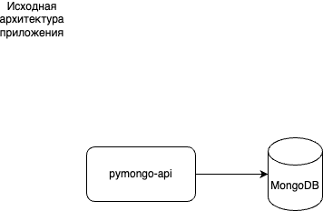

# pymongo-api

## Задача
Есть некоторый интернет-магазин, который в Черную пятницу решил сделать скидки на все товары.

И упал.

Потому что архитектура сервиса выглядела так:



Необходимо итеративно проработать архитектуру сервиса с прицелом на:
- масштабируемость
- отказоустойчивость
- производительность

## Решение (итеративное)

### Шаг 1

Здесть мы добавили шардирование для увеличения производительности


### Шаг 2

Здесть мы добавили репликацию для увеличения отказоустойчивости


### Шаг 3

Здесть мы добавили кеширование для еще большего увеличения производительности


### Шаг 4

Здесть мы добавили горизонтальное масштабирование приложения с использованием 
API Gateway и Service Discovery для увеличения отказоустойчивости и производительности


### Шаг 5

Здесь мы вообще ушли в отрыв и спроектировали для маленького интернет-магазина решение на случай
масштабирования бизнеса на мировой уровень и внедрили CDN для доставки статики по географическому признаку


## Полный набор решений в Draw.io

- [Полная схема](./sprint2.drawio)


## первые три итерации имеют решение в виде docker-compose.yaml и сопутствующих скриптов:

Ссылки на решения:

- [Шардирование в MongoDB](./mongo-sharding/Readme.md)
- [Шардирование и репликация в MongoDB](./mongo-sharding-repl/Readme.md)
- [Шардирование и репликация в MongoDB c кешированием в Redis](./sharding-repl-cache/Readme.md)


## Запуск

```shell
make up
```
## Инициализация
```shell
make init
```
## Остановка
```shell
make down
```

## Как проверить

### Если вы запускаете проект на локальной машине

Откройте в браузере http://localhost:8080

### Если вы запускаете проект на предоставленной виртуальной машине

Узнать белый ip виртуальной машины

```shell
curl --silent http://ifconfig.me
```

Откройте в браузере http://<ip виртуальной машины>:8080

## Доступные эндпоинты

Список доступных эндпоинтов, swagger http://<ip виртуальной машины>:8080/docs