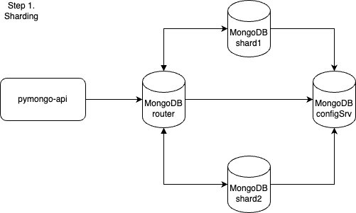

# Шардирование в MongoDB

## Задание
Изобразите, как вы будете использовать шардирование в 
MongoDB для повышения производительности. Двух шардов будет достаточно.

## Схема решения



## Решение
Система сконфигурирована в docker-compose.yaml

Сервер конфигурации 10.0.0.2:27019

Шарды 10.0.0.3:27018 и 10.0.0.4:27018

Роутер mongo 10.0.0.5:27017

Приложение pymongo-api 10.0.0.5


## Запуск

```shell
make up
```
## Инициализация
```shell
make init
```
## Остановка
```shell
make down
```

## Как проверить

### Если вы запускаете проект на локальной машине

Откройте в браузере http://localhost:8080

### Если вы запускаете проект на предоставленной виртуальной машине

Узнать белый ip виртуальной машины

```shell
curl --silent http://ifconfig.me
```

Откройте в браузере http://<ip виртуальной машины>:8080

## Доступные эндпоинты

Список доступных эндпоинтов, swagger http://<ip виртуальной машины>:8080/docs